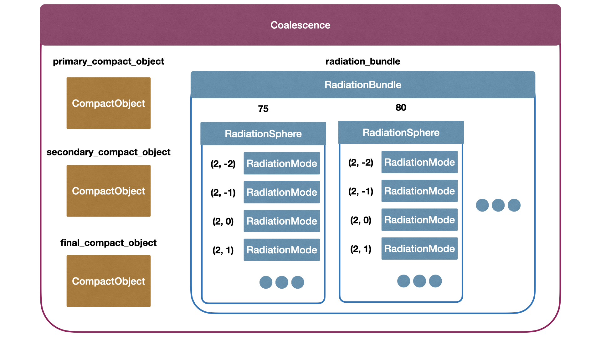
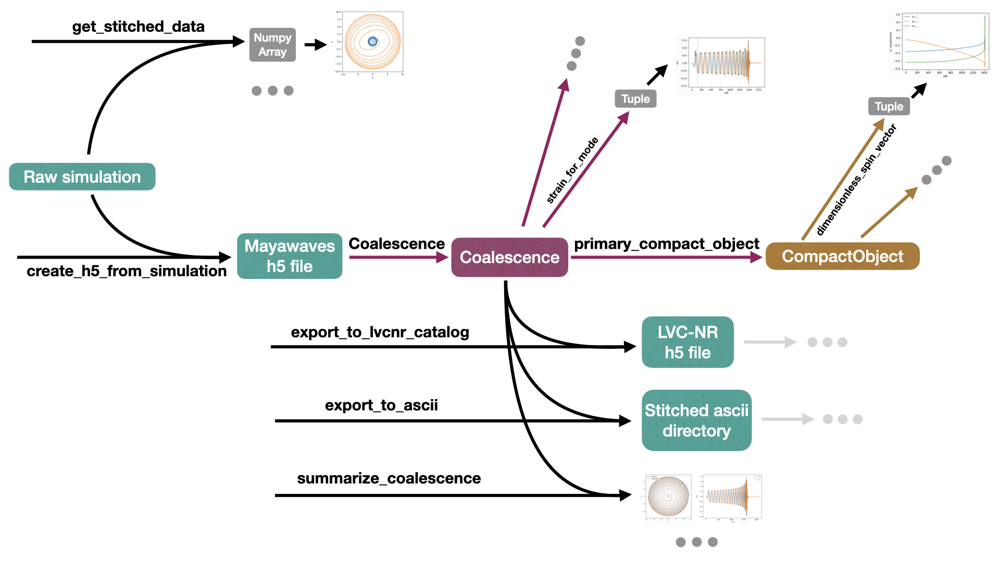

.. Mayawaves documentation master file, created by
   sphinx-quickstart on Thu May  6 10:28:27 2021.
   You can adapt this file completely to your liking, but it should at least
   contain the root `toctree` directive.

Getting Started
=====================================

How to install
-------------------------------------

This package can be installed either from PyPI or from source.

PyPi::

    pip install mayawaves

Source::

    git clone git@github.com:MayaWaves/mayawaves.git
    cd mayawaves
    pip install .

To use it in your python code, put::

    import mayawaves

at the top of your file. You can also import specific parts of mayawaves instead if you would rather such as::

    from mayawaves.utils.postprocessingutils import create_h5_from_simulation

Requirements
-------------------------------------
This package requires python :math:`\geq` 3.9.

It also relies upon the following python packages which are automatically installed from pip when you install mayawaves::

    freezegun, matplotlib, mock, numba, numpy, pandas, romspline, scipy, scri, wget

This package has been tested with Einstein Toolkit Release Meitner (released on December 6th, 2023).
It supports output from the following thorns::

    AHFinderDirect
    PunctureTracker
    QuasiLocalMeasures
    Multipole
    WeylScal4

In addition, it supports the following thorns that are specific to the MAYA catalog simulations::

    IHSpin
    ShiftTracker
    Ylm_Decomp
    RunStats

How to cite
-------------------------------------
If you use this library for your research please cite it using the following:

bibtex::

    @software{Ferguson_mayawaves_2023,
        author = {Ferguson, Deborah and Anne, Surendra and Gracia-Linares, Miguel and Iglesias, Hector and Jan, Aasim and Martinez, Erick and Lu, Lu and Meoni, Filippo and Nowicki, Ryan and Trostel, Max and Tsao, Bing-Jyun and Valorz, Finny},
        doi = {10.5281/zenodo.10035526},
        month = oct,
        title = {{mayawaves}},
        url = {https://github.com/MayaWaves/mayawaves},
        version = {v2023.10},
        year = {2023}
    }

APA::

    Ferguson, D., Anne, S., Gracia-Linares, M., Iglesias, H., Jan, A., Martinez, E., Lu, L., Meoni, F., Nowicki, R., Trostel, M., Tsao, B., & Valorz, F. (2023). mayawaves (Version v2023.10) [Computer software]. https://doi.org/10.5281/zenodo.10035526

These citations can also be downloaded directly from the github repository.

Basic overview of structure
-------------------------------------

Coalescence
^^^^^^^^^^^^^^^^^^^^^^^^^^^^^^^^^^^^^
The Coalescence object is the heart of the library. It interacts with an h5 file that contains everything about the
simulation.

CompactObject
^^^^^^^^^^^^^^^^^^^^^^^^^^^^^^^^^^^^^
Each Coalescence object has CompactObjects for each of the black holes involved in the simulation.
Refer to the "Compact Objects" tutorial for more details on how to use CompactObjects.
Each Coalescence object has a list of all compact objects as well as specific attributes to access the primary,
secondary, and final compact objects. Primary refers to the larger of the initial black holes.

RadiationBundle
^^^^^^^^^^^^^^^^^^^^^^^^^^^^^^^^^^^^^
Each Coalescence object also has a RadiationBundle that handles all the information pertaining to gravitational
radiation. This is primarily done behind the scenes and you can access all gravitational wave information directly
through Coalescence. Refer to the "Gravitational Waves" tutorial for more information on reading gravitational wave data.

The gravitational waves from Einstein Toolkit simulations are extracted on concentric spheres.
The data for each of these spheres is stored as a RadiationSphere, with each RadiationBundle containing several
RadiationSpheres.

To express the gravitational radiation in a way that is independent of the location on the sphere, we decompose it in
terms of the spherical harmonics.

:math:`RM\Psi_4(t;\Theta, \Phi) = \sum_{\ell, m}\Psi_{4; \ell, m}(t) {}_{-2}Y_{\ell, m}(\Theta, \Phi)`

This is done for each RadiationSphere, and each of these :math:`(\ell, m)` pairs is stored in a RadiationMode.

Utilities
^^^^^^^^^^^^^^^^^^^^^^^^^^^^^^^^^^^^^
There are also several utility modules including the postprocessingutils for analyzing raw simulation data and stitching
the raw simulation into the h5 format that the Coalescence object reads. This is shown in the creating_h5 tutorial. This
module can also be used to export Coalescence objects to the format used by LVK analyses, as shown in the exporting_lvk
tutorial.

The catalogutils module enables the user to interact with the entire MAYA catalog, to access metadata as well as
download the waveforms. The "Catalog Utils" tutorial walks through how to use this module.

Basic overview of workflow
-------------------------------------

The main object you will interact with as a user is the Coalescence, which contains all the information about the
simulation.

Obtaining a mayawaves compatible h5 file
^^^^^^^^^^^^^^^^^^^^^^^^^^^^^^^^^^^^^^^^
The MAYA Catalog waveforms are provided in two formats.
When using this library, you will want to download the MAYA-format file.
This file can then be used directly with Coalescence as described in the section below.

When beginning with a raw simulation, you can use::

    postprocessingutils.create_h5_from_simulation

to create an h5 file which can be read using the Coalescence object.
Refer to the "Creating a Mayawaves h5 File" tutorial for more detailed instructions.

Working with a mayawaves h5 file using Coalescence
^^^^^^^^^^^^^^^^^^^^^^^^^^^^^^^^^^^^^^^^^^^^^^^^^^
With this file in hand, you will begin by creating a Coalescence object from the file with::

    coalescence = Coalescence(h5_filepath)

From there, you can access data about the simulation directly including, but not limited to, gravitational wave data,
separation, eccentricity, energy radiated, etc.
For some examples, refer to the "Gravitational Waves" tutorial.
For an exhaustive list of Coalesence's attributes and methods, see :ref:`coalescence`.

You can also call the primary_compact_object, secondary_compact_object, or final_compact_object attributes to obtain
the CompactObjects associated with the coalescence. These know all information relevant to the specific compact object
in question including trajectory, mass and spin data, and any information from the apparent horizon.
Refer to the "Compact Objects" tutorial for example uses or the documentation (:ref:`compactobject`) for an exhaustive list of the
attributes and methods of CompactObject.

Using the postprocessingutils, you can also export the Coalescence object back into an ascii format or to the format
used in the LVK numerical relativity catalog.
Refer to the "Exporting to LVK Catalog Format" tutorial or the documentation (:ref:`utils`) for more details.

Using the postprocessingutils, you may also want to use the summarize_coalescence function to generate a quick summary
of the simulation including the initial parameters, plots of the gravitaitonal waves, and the trajectories.

Analyzing raw simulations without creating an h5 file
^^^^^^^^^^^^^^^^^^^^^^^^^^^^^^^^^^^^^^^^^^^^^^^^^^^^^^^^^^^
When monitoring ongoing runs or simply to make quick plots of a specific file, you can use::

    postprocessingutils.get_stitched_data

to stitch together all the output data for a given file.
This will return a numpy array in the same format as the requested data file.
Refer to the "Reading raw simulation files" tutorial or the documentation (:ref:`utils`) for more information.

Analyzing the MAYA Catalog
^^^^^^^^^^^^^^^^^^^^^^^^^^^^

Using the functions included in the catalogutils module, you can analyze the full public MAYA Catalog, searching by
parameters including initial spins, masses, eccentricities, etc and even downloading waveforms directly.
Follow the "Catalog Utils" tutorial for more details or refer to the documentation (:ref:`utils`).